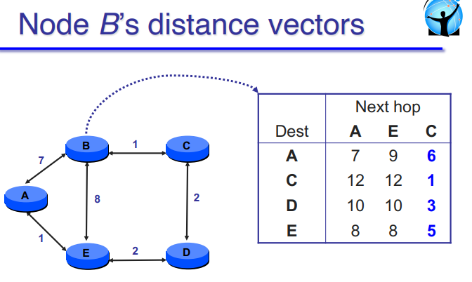
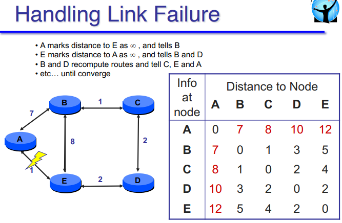
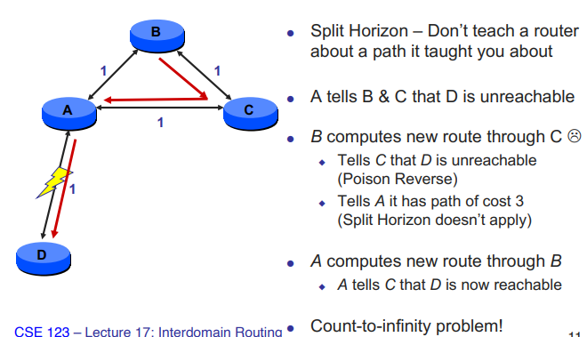
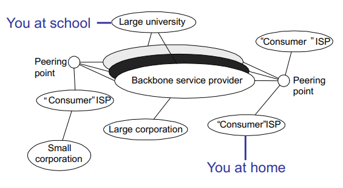
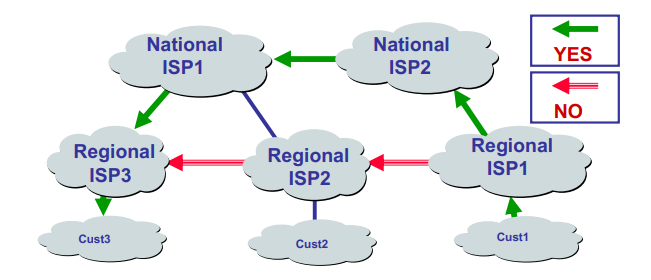

## Announcements
- Teacher emails went from eng --> ucsd. Profs got boned by the change since they relied on eng emails for comms.
- Everyone got 2 points for a T/F question. It was missing a word. Now the average is 88%. 

# Lecture 17: Interdomain Routing

## Step-by-Step Distance Vector
- $c(x,v)$ = cost for direct link from x to v
  - Node x maintains cost of direct links c(x,v)

- $D_x(y)$ = estimate least cost from x to y
  - Node x maintains distance vector $D_x$ = [$D_x(y): y \in N$]

- Node x maintains it's neighbors' disatnce vectors
  - For each neighbor v, x maintains $D_v$ = [$D_v(y): y \in N$]

- Each node v periodically sends $D_v$ to its neighbors
  - And neighbors update their own distance vectors
  - $D_x(y) \leftarrow min_c\{c(x, v) + D_v(y)\}$

> TODO: revisit podcast as necessary to understand Bellman-Ford

- going through C gives you the shortest path for ALL destinations
- Other neighbors optinos still there in case C goes down

- Note that you only know the next hop
  - No info on broken link on failure (unless direct link)

- Ideally: everyone starts re-anouncing and we re-converge :D
  - but not realistic

## Split Horizon / Poison Reverse & Limitations

- Split Horizon: Don't teach a router about a path it taught you about

- A notices it's neighbor is unreachable so it tells all the other neighbors

> This is just the clearest diagram. But there are other network layouts that could result in this problem. 
> As long as there is a "hidden" node

- Recall: Only know the next hop and total distance
  - B has no idea that C will take A (and loop back around!)

- Fix: Poison Reverse
  - claim unreachable (infinity cost) to everyone 
  - tell the one that told YOU about 
    - Even though A is not B's neighbor. Still claims unreachable
  - Issue: Count to infinity since they'll keep loop updating

- Fix: Claim infinity is small (set threshold = 20 or something)

> Wouldn't this impose restriction on network size? 

## Distance Vector - In Practice (Intra)

- RIP: Routing Information Protocol
  - DV protocol with hop counts as metric
    - Inf: 26 hops (limits network size)
    - Includes
      - split horizon
      - poison reverse
  - Routers send vectors every 30 seconds
    - async triggered updates for link failures
    - timout in 180 seconds to detect failures
    - Rarely used today (almost dead RIP)

> Not very scalable. Only meant for smaller (like 10 max routers) networks

- EIGRP: proprietary Cisco protocol 
  - Ensures loop-freedom (DUAL algorithm)
  - Only communicates changes (no regular broadcast)
    > makes sense considering costs don't change without cause (e.g. updating network layout, router down (worst case))
  - Combine multiple metrics into a single metric (BW, delay, reliability, load)

## DV Summary

- Distance Vector shortest-path routing
  - Each node sends list of its shortest "cost" to each destination to its neighbors
  > Bellman-Ford. Think of it as Dijkstra's with less info (cost only, not full path)

  - Neighbors update their lists; iterate

- Weak at adapting to changes out of the box
  - Problems include loops and count to infinity

## Link-State vs Distance Vector

Metric                  | Link-State                                    | Distance-Vector
---                     | ---                                           | ---
Message Complexity      | with n nodes, E links: O(nE) messages sent    | exchange between neighbors only
Speed of Convergence    | relatively fast                               | convergence time varies (- may be routing loops; - count-to-infinity problem)
Robustness (malfctins?) | - Node can advertise incorrect *link* cost; - Each node computes only its *own* table | - Node can advertise incorrect *path* cost; - Each node's table used by others (error propagates)

> Link-State looks awesome here but it got this by not being scalable (terrible message complexity)

## Routing so far...

- Shortest-Path routing
  - Metric-based, using link weights
  - Routers share a common view of path "goodness"
    > Takes a lot of trust. Geopolitically, countries are naturally distrusfull of eachother. Issues are raisd when brought to scale of **global internet routing**

- As such, commonly used *inside* an organization
  - EIGRP and OSPF are mostly used as *intra*domain protocols

- But the Internet is a "network of networks"
  - How to stitch the any networks together?
  - When networks may not have common goals
  - ... and may not want to share information

> Emphasis on the "network of networks" as opposed to just linking together all the routers in the world

## The Internet is Complicated

- INTER vs INTRA domain routing

> "shortest path" doesn't really exist. Internet has a very heirarchical structure
 

- Baskbone == interstate highways

> TODO: revisit podcast to hear about "Peering point"s and "meet me room"s

## A Brief History

- Original ARPAnet had single routing protocol
  - Dynamic DV scheme, repaced with static metric LS algorithm

- New networks came on the scene
  - NSFnet, CSnet, DDN, etc...
  - Total number of nodes was growing exponentially
    - w/ their own routing protocols (RIP, Hello, ISIS)
    - w/ their own rules (e.g. NSF AUP)

- New requirements
  - Huge scale: millions of routers
  - Varying routing metrics
  - Need to express business realities (policies)

## Shortest Path doesn't work 

- All nodes need common notion of link costs
- Incompatible with commercial relationships

- always want to go for the cheapest interstate highway 
- do NOT want to go from private regional to private regional

## A technical solution

- separate routing inside a domain from routing between domains
  - inside a domain use trditional interior gateway protocols (RIP, OSPF, etc.)
    - seen these already

  - between domains use Exterior Gateway Protocols (EGPs)
    - only excange reachability information (not specific metric)
    - Decide what to do based on local policy

- What is a domain?