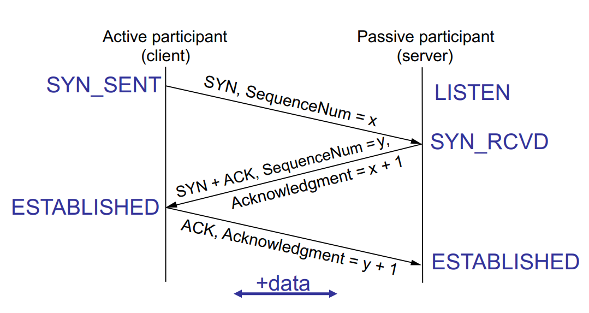

> Reminder: HW 1 due tonight

24hr extension for everything

# Lecture 8 Overview

- Finish closing TCP states

- Bridging & Switching (down to link layer)
    - Leaming bridges
    - Spanning Tree

## TCP State Transitions


## Again, with States



## Connection Teardown

> Extremely hard. Both sides need to come to agreement that they are done.

- Orderly release by sender and receiver when done
  - Delivers all pending data and "hangs up"

- Cleans up state in sender and receiver

- TCP provides a "symmetric" clause
  - Both sides shutdown independently, why? You don’t know
when the other side will be done!


Server receiving Client's ACK of their FIN --> doesn't mean the Client is done (might have more data before it sends it's own FIN).

Once Client received Server's ACK of their FIN --> Client knows that both are done and it closes the connection on client's own side.

Server has to TIME_WAIT. No way to know if Client got ACK! Will have to wait for Client to re-send FIN. CANNOT START A NEW CONNECTION
- Scenario: start new conn, old client sends FIN again, new conn get's early terminated.

### The TIME_WAIT State

- We wait 2***MSL** (Maximum segment lifetime) before completing the close

- Maximum segment lifetime is usually 60 seconds (longest period of time packet can be stuck in network)
  - Why? To be REALLY sure

- ACK might have been lost and so FIN will be resent
  - Could interfere with subsequent connection

- Real life: Abortive close
  - Don't wait for 2*MSL, simply send Reset packet (RST)
  - Why? Inefficient to wait every time

# Transition back to Link

Last time we were in Link Layer, we focused on framing and transmitting.

Now, we're going to focus on interlinking multiple links.

## Hubs/Repeaters

- Physical layer device
  - One "port" for each LAN
  - **Repeat** received *bits* on one port out *all* other ports

```
    LAN 1                   LAN 2
[H]-[H]-[H]-->[H U B]-->[H]->[H]->[H]
                 |
                 |
            L    v
            A   [H]
            N    v
            3   [H]         ^
                           ^^^
-- Like a christmas tree  **|**
```

### Hub Advantages

- Hubs can be arranged into hierarchies
  - Ethernet: up to four hubs between any pair of nodes

- Most of LAN continues to operate if "leaf" hub dies

- Simple, cheap

```
              backbone hub
                ( hub )
                /     \
               /       \
  10BaseT   ( hub )  ( hub )  10BaseT
             /           \
            /             \
         Elec Eng     Comp Sci
```

### Still one big shared bus

- Single collision domain
  - No improvement in max throughput as you add more links
  - Average throughput (<<<) as # nodes increases
  - Why? all nodes have to wait until one is done sending packet

- Still limited in distance and number of hosts
  - Collision detecction requirements
  - Synchronization requirements

> Introduces potential for introducing an error. Just a dumb repeater, no additional CRC checks!

- Requires link technology homogeneity
  - Can't connect both 1 Gbps and 100 Mbps devices to the network

> need to be able to mix/match tech for use case. All new is too expensive, all old is too slow

## Bridge

- **Store and forward** device
  - Data-link layer device
  - Buffers entire packet and *then* rebroadcasts it on other ports
  - Regenerates transmission so network can be longer distance

- Creates **separate** Collision Domains (CD)
  - Senses line for access to each LAN (acts like a host)
  - Can accomodate different speed interfaces (issues?)
  - Separate CDs iproves throughput (why?)

- Can significatly improve performance
  - Not all frames go everywhere. (Why did they with a hub?)

## Selective Forwarding

- Only reboradcast a frame to the LAN where its destination resides
  - A --> X, then bridge must forward frame
  - A --> B, then bridge shuoldn't

```
Lan1    Lan2
```

## Switched Ethernet (common type of bridging)

- Hosts **directly connected to a bridge**
  - learning + spanning tree protocol

- Switch supports parallel forwarding
  - A-to-B and A'-to-B' simultaneously
  - Generally full duplex as well

- **Switch** backplane capacity values
  - Ideally, **non-blocking**
  - i.e. can run at full line rate on all ports

- No sharing of links
  - Each link is it's own collision domain
  - Collision detection largely irrelevant

> So useful it got comodized --> Nowadays it's as cheap as hubs were then. 1Gbps 48 Port Switch for $50, maybe even $10 now.

## Forwarding Tables in Bridges

- Need to know "destination" of frame
  - Destination "MAC" address in frame header (48b in Eth)

- Need know which destinations are on which LANs
  - One appraoch: statically configure tables by hand
    - \>\>  mapping address to output port (i.e. LAN)
  - But we'd prefer something automatic and dynamic...

- Simple algo for static forwarding table:
```
Receive frame f on port q

Lookup f.dest for output port               // know where to send it?

If f.dest found
    then if output port is q then drop      // already delivered
    else forward f on output 
```

> FUCK, need to revisit slides again

## Learning Bridges

- Eliminate manual configuration of forwarding tables by learning which addresses are on which LANs

- Basic approach
  - If a frame arrives on a port, then associate its source address with that port
  - As each host transmits, the table becomes accurate
  - If you don't know where a host is, **flood**

- What if a node moves? Table aging
  - Associate a timestamp with each table entry
  - Refresh timestamp for each new packet with same source
  - If entry gets too stale, remove it

Example: 
Host | Port
--- | ---
A   | 1
B   | 1
C   | 1
D   | 1
W   | 2
X   | 2
Y   | 3
Z   | 2

### Learning Example

Suppose C sends frame to D and D repies back with frame to C

```
    H ... I J
    ---------
A| 1    |3    2 |F
.|--[ bridge ]--|.
.|              |.
.|              |.
B|              |E
C|              |D
```

- C sends frame, bridge has no info about D, so floods to both LANs
  - bridge notes tha tC is on port 1
  - Frame ignored on upper LAN
  - frame received by D

- D generates reply to C, sends
  - bridge sees frae from D
  - bridge notes tha tD is on port 

> FUCK. Need to revisit slides again

### Learning Bridge Recap

- Each bridge keeps a list mapping link-layer *destination* addresss to port number
- This list is populated by looking at the *source* address of each packet it receives on a given port and enteringthose values int he table
- If a pcket ar

> FUCK. Need to revisiti slides again

> Note: I get waay too sidetracked with these drawing/diagrams haha

## Network Topology CHoices

```
(hub) - [bridge] - (hub) - [bridge] - (hub)
n n n              n n n              n n n
```
- Linear Organization
  - Inter-bridge hubs (e.g. CS) are single points of failure
  - Unnecessary transit (e.g. EE<->SE must traverse CS)


```
      [bridge] 
     /    |   \
    /     |    \
(hub)   (hub)  (hub)
n n n   n n n  n n n
```
- Backbone / tree (hub in spoke)
  - Can survive LAN failure
  - Manages all inter-LAN comms
  - Requires more ports  

> Decision depends on physical implementation. Would need to physically dig trenches between all buildings to a central location (notice the longer wires in the diagrams)

## An Issue: Cycles

- Learning works well in tree topologies

- But trees are fragile
  - No redundant links

> Revisit slides for diagram

- How to handle Cycles?
  - Where should B1 forward pckaets distinnned for LAN A (3 copies of packets go to A!)

> Public Enemy #1 for Internet: **Shovels**! They're usually 5-6 ft deep and people hit and cut them w/ shovels. Recall the trenches!