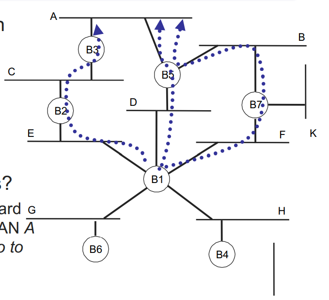

# Lecture 9 Overview

- Bridging and Switching (cont)
  - Spanning Tree review

- Internetworking
  - Routing
  - Internet Protocol

## An Issue: Cycles

- Learning works well in tree topologies

- But trees are fragile
  - no redundant links

- how to handle cycles?
  - Where should B1 forward packets destined for LAN! (3 copies of packets go to A!)



## Spanning Tree

- Uses *subset* of bridges so there are no cycles
  - Prune some ports
  - only **one** tree at a time

- Q: How do we find a spanning tree?
  - Automatically!
  - Elect root, find paths


### Algorithm

- Each bridge sends periodic configuration messages
  - RootID, DistToRoot, BridgeID
  All nodes THINK they are root initially

- Each bridge updates route/Root upon receipt
  - Smaller root address is better
  - Select port with lowest cost to root as "root port"
  - to break ties, bridge with smaller address is better

- Reboradcast new config to pors for which we're "best"
  - Don't bother sending config to LANs with better optionsAdd 1 to distance, send new configs on ports that haven't told us about a shorter path to the root

- Only forward packets on ports for which we're on the shortest path to root (prunes edges to form tree)

### Example

Sample mmessage to and from B3:
```
B3 -(B3, 0, B3)-> B2 [LAN C] & B5 [LAN A]
B3 <-(B2, 0, B2)- B2    // swaps B3's root to be B2
B3 <-(B5, 0, B5)- B5
B3 -(B2, 0, B3)-> B5
B3 <-(B1, 1, B2)- B2    // swaps B3's root to be B1
B3 <-(B1, 1, B5)- B5

// B3 wants to send (B1, 2, B3)
// but doesn't as it's nowhere "best"

// Repeatedly receives the following
B3 <-(B1, 1, B2)- B2
B3 <-(B1, 1, B5)- B5

// B3 turns off forwarding to LAN A and LAN C
// -- doesn't offer any shorter paths to them
```


### Important Details

- What if root bridge fails?
  - Age configuration info
    - If not refreshed for MaxAge seconds then delete root; recalc spanning tree
    - If config message is received with a more recent age; recalc spanning tree
  - Applies to all bridges (not just root)

- Temporary loops
  - When topology changes, takes a bit for new configuration messages to spread through the system
  - Don't start forwarding packets immediately --> wait some time for convergence

## Layer-2 Forwarding

- Create spanning tree across LANs
  - Learn which ports to use to reach which addresses

- Benefits
  - Higher link bandwidth (point-to-point links)
  - Higher aggregate throughput (parallel communication)
  - Improved fault tolerance (redundant paths)

- Limitations
  - Requires homogenous link layer (e.g. ALL Ethernet)
  - Harder to control forwarding topology
  - Security and performance issues (trust is assumed)

- What if we want to connect different networks together?

## TCP/IP Protocol Stack


## Combining Networks together

- Main challenge is heterogeneity of link layers:
  - Addressing
    - Each network media has a diff addressing scheme
  - Bandwidth
    - Dial-up modems to terabit optical networks
  - Latency
    - Seconds to nanoseconds
  - Frame Size
    - Dozens to thousands of bytes
  - Loss Rates
    - Differ by many orders of magnitude
  - Service Guaratees
    - "Send and pray" vs reserved bandwidth

## Internetworking

- Cerf & Kahn74 
  "A Protocol for Packet Network Intercommunication"
  - Foundation for the modern internet
> Go read it and you'll realize it's still how the internet works today

- **Routers** forward **packets** from source to destination
  - May cross many separate networks along the way

- All packets use a common **Internet Protocol**
  - Any underlying data link protocol
  - Any underlying transport protocol
  - This is the "thin waist"

> Very scarce bottlenecks/issues. Everything is built on IP, but they pretty much nailed it.

## Internet Protocol (IP) Networking


## Routers

- Router is a **store-and-forward** device
  - Connected to multiple networks
  - On each network, looks like another host
  - A lot like a switch, but also:
    - supports **multiple datalink layers** 
    - makes forward/drop decision **at the network layer**

- Must be explicitly addressed by incoming frames (L2)
  - Not at all like a switch, which is transparent
  - Removes link-layer header, parses IP header (L3)

> Like baggage at an airport. The router is the airport

- Looks up next hop, forwards on appropriate network
  - Each router need only get one step closer to destination

> Decisions for this does not happen based off efficiency or cost. It's more on politics and relations :neutral_face: