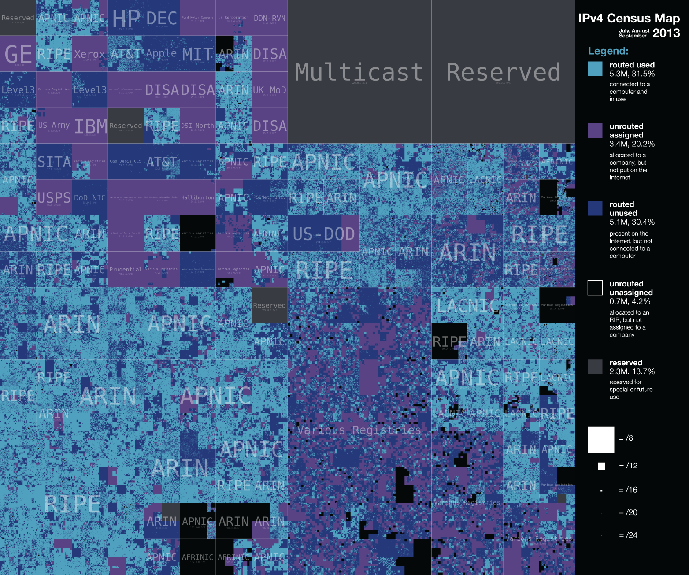

# Lecture 11: Internet Addressing

## IP Forwarding Tables
- Router needs to know where to forward a packet

- Forwarding table contains
  - Lit of **network names** (e.g. **LANS**) and **next hop** routers
  - Local networks have entries specifying which interface
    - Link-Local hosts can be delivered with Laye-2 forwarding

- Adress of incoming internetwork packet needs to say
  - What is dest **network**?
  - what is dest **host** in that network?

## IPv4 Addresses - Network + Host

- 32-bits in an IPv4 Address
    - dotted decimal format a.b.c.d
    - Each represent 8 bits of address

- Hierarchical: Network part and host part
  - E.g. IP: 128.54.70.238
  - 128.54: UCSD campups network
  - 70.238: refers to the host ieng6.ucsd.edu

- How do we define which part is network (e.g. LAN) vs host?

## Class-based Adressing

- Most significant bits determines "class" of address

```
    Class A [0| Network | Host        ] 127 nets, 16M hosts

                    14       16
    Class B [1|0| Network | Host      ] 16K nets, 64K hosts

                        21         8
    Class C [1|1|0|  Network  | Host  ] 2M nets, 254 hosts
```

> UCSD had a class A, someone in network research dept held onto it (got it since HAM radio were working since it was early) and recently sold it to amazon

- Special Addresses
    - Class D(1110) for multicast
    - Class E(1111) experimental
    - 127.0.0.1: localhost (i.e. loopback)
    - 0.0.0.0: network address
    - 1.1.1.1: broadcast address

## Subnetting (network in network)

- individual networks may be composed of serveral subnetworks
  - only want to route traffic to hsots on a sepcific subnetwork
  - Routers need a way to know which hosts are in which subnetwork

- Networks can be arbitrarily decomposed into subnets
  - Each subnet is simply a prefix of the host address portion
  - Subnet prefix can be of any length, specified with netmask
  ```ditaa {cmd args=['-E']}
        +---------+--------+-----------------+
        | Network | subnet | Host            |
        +---------+--------+-----------------+
  ```
  - Netmask specified by admins and set on hosts/routers

  ### Subnet Addresses
  - Every (sub)network has an address and a **netmask**
    - netmask tells which bits of the network address is important
    - convention suggests it be a proper prefix 
      - Starting from higher order bits of address
    
  - Netmask written as an all-ones IP Address
    - e.g. Class B: 255.255.0.0
    - Sometimes expressed in terms of number of 1s, e.g., /16

  - Need to size subnet appropriately for each subnetwork
    - Only have remaining bits to specify host addresses

## IP Address Problem (1991)
- Address space depletion
  - In danger of running out of classes A and B

- Why?
  - Addresses only allow for fixed-size address allocations
    - Class C too small for most organizations (~250 addresses)
    - Very few class A - very careful about giving them out (who has 16M hosts anyways?)
      - Also few options for hierarchy of subnetworks
    - Class B - greatest problem

## CIDR
- Classless Inter-Domain Routing (1993)
  - Networks described by variable-length prefix and length
  - Allows arbitrary allocation between network and host address
  ```ditaa {cmd args=['-E']}
        +---------+----------------+
        | Network |      Host      |
        +---------+----------------+
          prefix   Mask = # sig bits representing prefix
  ```
    - e.g. 10.95.1.2 contained within 10.0.0.0/8
      - 10.0.0.0 network and remainder 95.1.2 is host

- Pro: finer grained allocation: hierarchical aggregation
- Con: more expensive forwarding table lookup: **longest prefix match**

  ### Longest Prefix Match
  - Forwarding table contains many prefix/length tuples
    - Need NOT be hierarchical
    - E.g. 200.23.16.0/20 and 200.23.18.0/23 both in table
    - What to do if packet arrives for destination 200.23.18.1?
    - Need to find the longest prefix in the table which matches it (200.23.18.0/23)

  - Not a simple table, requires multiple memory lookups
    - Lots and lots of research done on this problem
    - Lots of work was historically done by UCSD faculty

  ### Addressing Considerations
  - Fixed length or variable length addresses?

  - Issues:
    - Flexibility
    - Processing costs (tricky hardware design)
    - Header size

  - Engineering choice: IP uses fixed length addresses

## IPv4 Census Map


> ARIN, RIPE, APNIC: regional registrars that handle IP stuff nowadays

## IPv6 vs IPv4 header
```ditaa {cmd args=['-E']}
+-------+-----------+-----------------------+
| Ver.  | Traffic   | Flow Label            |
|       | Class     |                  c666 |
+-------+-----------+---+-----------+-------+
| Payload Length        | Next      | Hop   |
|                       | Header    | Limit |
+-----------------------+-----------+-------+
|                                           |
|                                           |
| Source Address                            |
|                                           |
|                                           |
+-------------------------------------------+
|                                           |
|                                           |
| Destination Address                       |
|                                           |
|                                           |
+-------------------------------------------+


+-------+-------+-----------+-------------------+
| Ver.  | Hdr   | Type of   | Total Length      |
|       | c666  |           |                   |
+-------+-------+-----------+-------+-----------+
| Identification            | Fig   | Fragment  |
| c666                      | c666  | c666      |
+---------------------------+-------+-----------+
| Time to Live  | Protocol  | Header Checksum   |
|               |           | c666              |
+---------------+-----------+-------------------+
| Source Address                                |
+-----------------------------------------------+
| Destination Address                           |
+-----------------------------------------------+
| Options...                                    |
| c666                                          |
+-----------------------------------------------+
```
- Grey bits are unique to each header
- Changes
  - Eliminate fragmentation-related fields
  - Eliminate header checksum
  - Added flow label
  - Quadruple size of addresses
  - IPv6 header (40B) vs IPv4 (20B)
  - Hop limit == TTL

## Extension Headers
- Effectively a linkedlist of headers
  - Next header --> pointer

- 2 different types
  - **Destination**, intended for the IP endpoint
    - 44: Framentation Header (it's baaaaack)
    - 43: Routing header (dictates how to route the packet)

- **Hop-by-hop**, processed by each node on the path
    - Each node takes a look at it and can modify it

## IPv6 transition is difficult
- Need to support both protocols at the same time
  - Complicated... if a destination has both an IPv4 andn IPv6 address which to use?

- Less need in developed world -> slower adoption

- That said...
  - All major operating systems now support ipv6
  - All major router vendors
  - US Mobile carriers (e.g. Tmobile, Verizon, etc.)
  - Offered by many US wired ISPs (Spectrum, Xfinity)

- IPv6 is dominating mobile carrier traffic

## Check your phone now!

> Most carriers default to ipv6 now

## Summary
- Can't route efficiently on flat address space
  - need a table the size of all hosts on the internet
  - need to send updates about that table to everyone

- Network-layer addressing is done heirarchically
  - Routing prefix + host suffix
  - Originally, split was done statically (class-based addressing)
  - Now it is done dynamically (CIDR)
  - Requires more complex forwarding table lookup
  - Allows contiguous chunks of address space to be aggregated (for the purposes of routing) into fewer prefixes

- IPv6 fixed address shortcomings of IPv4