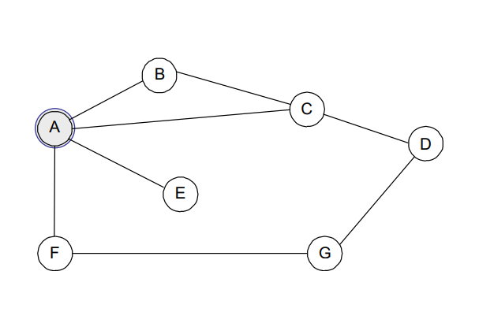
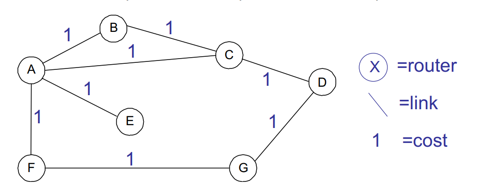
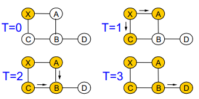

## Announcements

Mon holiday, review readings on Tuesday prior to Wed lecture!

PA3 is out. Start early!

# Link State Routing

Overview:
- Intra domain routing
  - Intro to concept
  - Link-state routing

## Intro to routing

Forwarding
- move packet from inp link to approp out link
- purely local comms
- must be VERY FAST (exec for every packet)

Routing (make decisions)
- make sure next hop leads TOWARDS dest
- Global decisions: distributed computation and communication
- Can go slower (only impo when topology changes)

> Decisions based off algorithms, global standards, statistics, etc.

> Routers do BOTH

## Routing options

Source Routing
- complete path listed in packet

Virtual circuits
- set up path out-of-band and storepath identifiers in routers
- local path identifier in packet

**Destination-based routing**
- Router looks up address in forwarding tables
- Forwarding table contains(addr, next-hop) tuples
    > Generated by some algorithm that performs decision making 

### Source Routing

> Supercomputers use this. Main goal of supercomputer is to be as fast as possible.

Routing
- host computes path
  - Must know global topology and detect failures
    > Makes it difficult to implement in practice
- Packet contains complete ordered path information
  - I.e. node A then D then X then J...
- Requires variable length path header

Forwarding
- Router looks up next hop in packet header, strips it off and forwards remaining packet
- Very quick forwarding, no lookup required

In practice
- ad hoc networks (DSR), some HPC networks (Myrinet) and for debugging on the Internet (LSR, SSR)

### Virtual Circuits

> A bit more common. Used by places like hospitals. Real service provided by telecomm companies. 

> Whole billion dollar market on it's own. A very useful service liked by a lot of companies. An isolated circuit, private service, direct connection.

Routing
- Hosts sets up path out-of-band, requires connection setup
- Write (input id, output id, next hop) in table on each router  
  Flexible (one path per flow)

Forwarding
- Send packet with path id
- Router looks up input, swaps for output, forwareds on next hop
- Repeat until reach destination
- Table lookup for forwarding (why faster than IP lookup?)

In practice
- ATM: fixed VC identifiers and separate signaling code
- MPLS: ATM meets theIP world (why? *traffic engineering*)

> MPLS is most prominent service provided

### Destination-based

> Most common, but also the most taxing on routers.

Routing
- All addresses are globally known
  - no connection setup
- host sends packet with destination address in ehader
  - no path state; only routers need to worry about failure
- Distributed routing protocol that populates routing tables

Forwarding
- Router looks up destination in forwarding trable
  - Must keep state proprortional to destinations rather than connections
- Lookup address, send packet to next hop link
  - all ackets follow same path to destination

In practice, **THIS IS WHAT WE USE FOR INTERNET ROUTING**

## Intra-domain IP routing

routing **within** a network/organization
- singel administrative domain
- administrator can set edge costs

Overall goals
- provide **intra**-network IP router connectivity
- Adapt quickly to failures or topology changes
- Optimze use of network resources

Non-goals
- Extreme scalability
  > Only focus on our own network (~100 routers)
- Lying, and/or disagreements about edge costs
- It's simpler, we will start by discussing it
  > Will build up towards inter-domain

> Big internet service provider has to deal with this issue. All international companies that has network service as their business model runs into this problem.

## Routing Tables

The routing table at A, lists - at a *minimum* - the next hops for the different destinations

Dest | Next Hop
--- | ---
B | B 
C | C
D | C
E | E
F | F
G | F



## Routing on a Graph

Essentially a graph theory problem
- network is s directed graph; routers are vertices

Find "best" path between every pair of vertices
- In the simplest case, best case is the shortest path



## Routing Challenges

How to choose best path?
- Defining "best" can be slippery

How to scale to millions of destinations (addresses)?
- Minimize control messages sent between routers and routing table size in each router

How to adapt to failures or changes?
- Node and link failures, plus message loss

> Based off Dijkstra's but added complexities. What are we trying to optimize?

## Basic Approaches

Static
- type in the right toutes and hope they are always true
- ... so far (content wise)

**Link State**
- Tell **everyone** what you know about your **neighbors**
- Today's lecture!

Ditance Vector
- Tell your **neighbos** what you know about **everyone**
- Next time... (content wise)

> More scalable but also introduces a Distributed agorithms problem

### Link-State Routing

Two Steps
- reliable flooding
  - tell all routers what you know about your local topology
  > not efficient, high redundancy in messages (waste)
- Path calculation (Dijkstra's algorithm)
  - Each router coputes best path over complete network

Motivation
- Global information allows optimal route computation
- Straightforward to implement and verify

#### Broadcasting Link State

Reliable Flooding
- Each router transmits a **Link State Packet** (LSP) on all links
  > Similar to packets sent during Spanning Tree algo
- Neighboring router forwards out all links except incoming
  - keep a copy locally; don' forward previously-seen LSPs

Challenges
- Packet loss
  > Can we even compute Dijsktra's with incomplete info?
- Out-of-order arrival

Solutions
- Acknowledgements and retransmissions
- Sequence numbers
- Time-to-live for each packet

#### Flooding Example

- LSP generated by X at T=0
- Nodes become orange as they receive it



- Entire process repeats with LSPs for A, B, C, ...
  - actually in runs in parallel

#### Dijkstra's Shortest Path Tree

- So you have all of these LSPs. Now what?
- Graph algorithm for a single-source shortest path tree (find best route to all nodes)

```
S <- {}
Q <- <remaining ndoes keyed by distance>

While Q != {}
    u <- extract-min(Q)         // u = node with lowest cost
    S <- S plus {u}             // u is done
    Within Q:
        for each node v adjacent to u
            “relax” the cost of v       
                                // is it cheaper to go through u?
```

> In lecture demo done, would involv a shit ton of copy pasting images here, so just refer to podcast to revisit 😅

Notes:
- Use node values to decide path
- Use edge values to "update costs"
  - chosen node value + outgoing edge values --> dest node values

What about when a link dies?
- Use a timeout to figure out when

All routers decide paths on their own
- Everyone sending and receiving LSPs
- Everyone is doing Dijkstra's on their own
- Problems with de-sync:
  - packet can be sent to a node that hasn't finished Dijstra's yet (expecting it to send it on path A)
  - that node that hasn't finished might NOT send along path A, it might think that path B is the most efficient ATM

Need to handle:
- timeouts
- cost updates (bandwidth)
- syncing graphs/chosen paths