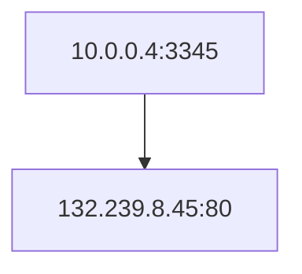

## Project Info

Implement router. Linux has a framework for building one.

## Using DNS

> Abstracted. Everyone uses it but doesn't think about it. Who says "my dns is off"?

Local DNS resolver (default name server)
- usually near end host who uses it
- localhosts configured with local server
  - `/etc/resolv.conf`
  - or learn the server via DHCP

Client Application
- Extract server name (e.g. from URL)
- Do `gethostbyname()` to trigger resolver code
  - Forward lookup

> A lot of trust. The code running in your host, the server on your network, etc. Massive network of trust,,, catastrophic when it doesn't work

Server Application
- Extract client IP adress from socket
- Optionl `gethostbyaddr()` to translate into name
  - Reverse lookup

> Potential issue. The reverse lookup could return a list since there are servers out there that host MULTIPLE sites on the same IP.

There's this unix command for lookups:

```sh
> host ieng6.ucsd.edu
ieng6.ucsd.edu has address 128.54.70.238
ns-auth1.ucsd.edu has address 44.227.162.249
ns-auth2.ucsd.edu has address 132.239.252.172
ns-auth3.ucsd.edu has address 132.239.252.186
ns-auth2.ucsd.edu has IPv6 address 2607:f720:100:202::174
ns-auth3.ucsd.edu has IPv6 address 2607:f720:f00:4446::186
ieng6.ucsd.edu mail is handled by 15 acs-mailscan-2.ucsd.edu.
ieng6.ucsd.edu mail is handled by 10 acs-mailscan-1.ucsd.edu.
ieng6.ucsd.edu mail is handled by 80 inbound.ucsd.edu.
ieng6.ucsd.edu mail is handled by 20 acs-mailscan-3.ucsd.edu.
ieng6.ucsd.edu mail is handled by 50 ieng6.ucsd.edu.
acs-mailscan-3.ucsd.edu has address 128.54.65.141
ieng6.ucsd.edu has address 128.54.70.238
acs-mailscan-2.ucsd.edu has address 128.54.65.141
acs-mailscan-1.ucsd.edu has address 128.54.65.141
inbound.ucsd.edu has address 148.163.141.31
inbound.ucsd.edu has address 148.163.145.30
ns-auth1.ucsd.edu has address 44.227.162.249
ns-auth2.ucsd.edu has address 132.239.252.172
ns-auth3.ucsd.edu has address 132.239.252.186
ns-auth2.ucsd.edu has IPv6 address 2607:f720:100:202::174
ns-auth3.ucsd.edu has IPv6 address 2607:f720:f00:4446::186

> host 128.54.70.238
238.70.54.128.in-addr.arpa domain name pointer ieng6.ucsd.edu.
ns-auth1.ucsd.edu has address 44.227.162.249
ns-auth2.ucsd.edu has address 132.239.252.172
ns-auth3.ucsd.edu has address 132.239.252.186
ns-auth2.ucsd.edu has IPv6 address 2607:f720:100:202::174
ns-auth3.ucsd.edu has IPv6 address 2607:f720:f00:4446::186
```

> TODO: revisit slides. Copy example diagram 

It would be incredibly slow to run a full DNS lookup every time, it involves a LOT of server interactions to resolve a name.

local DNS resolver uses caching to speed up the process.

> Again. It's a very vulnerable ecosystem built on a network of trust. Governments, countries, and malicious actors have all taken advantage of the system to exploit people's trust

## Reliability

> Focusing on functionality without worrying about attacks

DNS servers are replicatd
- Name services available if at least one replica is up
- Qiueries can be load balanced between replicas

Transport: UDP used for queries (TCP is slow and uncessary)
- Need reliability: so must implement on TOP of UDP
- Try alternate servers on timeout
- exponential backoff when retrying same server

Cache responses to decrease load
- Both at end hosts and local servers


> Storytime: Arab spring? Coutnries block DNS to oppress people. People were spraying 8.8.8.8 on walls. If locals are blocked, then use googles. 

> Google and Cloudflare and other CDN companies want to bypass local resolver. They DON'T trust local resolvers. They want to have control over what you get when you do lookups. It caused a lot of political backlash. Most phones don't use ISP resolver but use Googles resolver instead.

> DNS can (and is) an entire class on it's own.

> Also there is a way to do encrypted DNS lookups. Most of those are run by CDN companies. The same ones that are trying to centralize DNS. So local can't see, but Google and Cloudflare, etc. CAN

## Private IP Address Space

Sometimes you can't get/dont' want IP addresses
- An organization wants to change service providers without having to renumber its entire network
- A network may be unable to obtain (or cannot cafford) enough IP addresses for all of its hosts

IP provides private address space anyone can use
- 10/8
- 192.168/16
- 172.16.0/20
- These addresses are not routable-- Internet routers should drop packets destined to these so-called **bogons**

> Internet providers started running out of address spaces internally, and can't use private either. Solution was to use military reserved IP addres space for internal knowing that it won't be routable on the internet. Smart soln

What good are they if can't use them on internet?

## Network Address Translation

We are running out of address space

Hack: Gateway router can rewrite IP addresses as packets leave or enter a given network
- ie.e. replace private addresses with public ones
- Router needs to see and update every packet

> It's one of those 'Student says "cant' we just use this hack?" and it's a eureka moment and it gets shipped to be deployed globally' moments

Maintains a mapping of private-to-public addresses
- Simple case is a one-to-one mapping
- Anytime you change provider, just update mapping table
- In more clever scenarios, can map a **larger set of private addresses tosmaller set of public adderesses**
- In the extreme map the entire private network to one public IP

> Hack: Transport layer protocol is used to alias the mapping (uses port numbers). Weird because now you're using both Trans and Net layer to handle a Net task

## IP Masquerading (aka NAT)

AKA
- Network Address [and port] Translation (NApT)
- Port Address Translation (PAT)
- colloquially just NAT

Entire loacl network uses just one IP address as far as outside world is concerned:
- Can chagne addresses of devices in local network without notifying outside world
- Can change ISP without changing addresses of devices in local network
- Devices inside local net not explicityly addressable, visible by outside world (a security plus).

> Carrier Grade IP Masquerading (CGN) 

### A NAT'd network

> TODO: revisit slides. Copy diagram here

rest of internet --> [router] <-- local network (10.0.0.0/8)
- All packets leaving local network has same single source NAT IP addr



> TODO: revisit slides and finish the sequence diagram

#### NAT translation table
WAN Side addr       | Lan Side Addr
---                 | ---
138.76.29.7:5001    | 10.0.0.4:3345

> operating system randomly picks your src PORT number for each net request

> Most ISP will drop attempts to spoof IP packets. 

### NAT Challenges

> useful for more tasks. Makes it hard for external attacker to target specific hosts within a network

End hosts may not be aware of external IP addr
- Some applications include IP addresses in application data
- Packets will ocntain private IP addresses inside payload
- Many NATs will inspect/rewrite certain protocols (e.g. FTP)

NAT'd end hosts are nto reachable from the Internet
- All connections must be initiated from within private network
- Alternative is to configure fixed forwarding in NAT
- Many protocols for **NAT traversal** to get around this

> here's the thing with hacks. It always introduces more complexity. Which is what NAT did