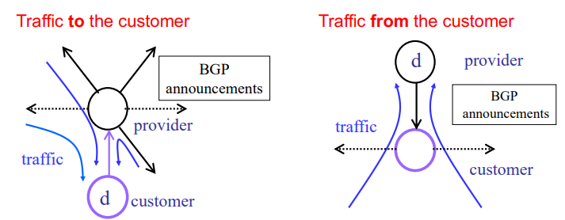
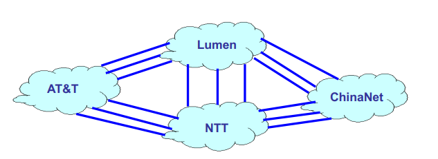
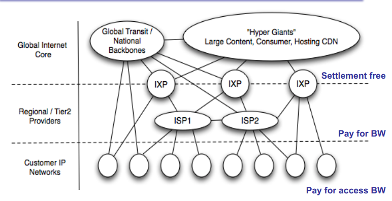
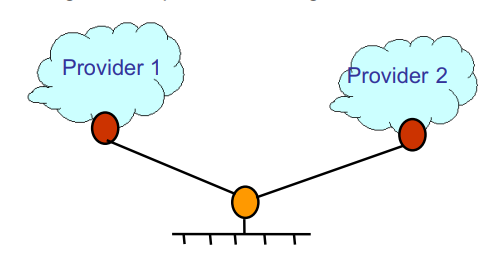
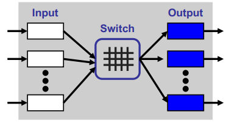
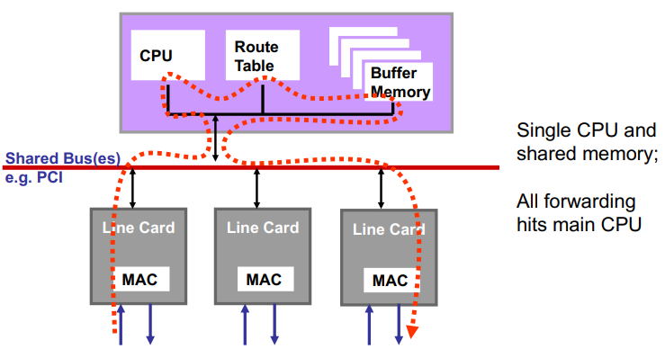
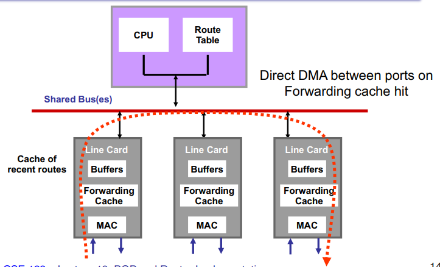

## A History of Settlement ($$$)
- the telephone world
  - LECs (local exchange carriers) (e.g. PacBell, NYNEx)
  - IXCs (inter-exchange carriers) (e.g. Sprint, AT&T)

- LECs MUST provide IXCs access to customers
  - This is enforced regulation

- When a call goes from one phone company to another:
  - Call billed to the caller
  - the money is split up among the phone systems
    - this is called **settlement**

## AS Business Relationships

> Lack of governing body and regulation --> contributed to speed of developent and open innovation in the growth of Internet

- Neighboring ASes have business contracts
  - How much traffic to carry
  - Which destiations to reach
  - How much money to pay

- Common business relationships
  - Customers pay providers (95% billing model)
    - E.g. Princeton is a customer of USLEC
    - E.g. MIT is a customer of Lumen
  - Peers don't pay peers (exchange equal traffic for free)
    - E.g. Verizon is a peer of AT&T
    - E.g. Harvard is a peer of Harvard Business School
  - Routing follows the money (allow inexpensive paths)

> Verizon is deployed heavily in East Coast. AT&T is deployed heavily in West. Seemingly counter-intuitive for competing service providers to collaborate and offer services for free but it's overall faster and more cost-efficient (barters/trades is not income)

## Customer/Provider
- Customer needs to be reachable from everyone
  - Provider tells all neighbors how to reach the customer

- Customer does not want to provide transit service
  - Customer does not let its providers route through it to other providers
  > Mailman doesn't hand you your neighbors mail and expect you to do extra work



## Tier-1 Providers
- Make up the "core" of the Internet
  - Has no upstream provider of its own
  - Typically has a national or international backbone

- Top of the Internet hierarchy o ~10-20 ASes
  - E.g. AT&T, Lumen (CenturyLink), NTT/Verio/ Verizon, ChinaNet
  - Full peer-peer connectiosn between tier-1 providers



## The Internet Hierarchy

- Global Internet Core
  - Gobal Transit  National Backbones
  - "Hyper giants" Large Content, Consumer, Hosting CDN
  - Settlement Free

`<--- IXP ---> <--- IXP ---> <--- IXP --->`

- Regional/Tier 2 Providers
  - ISPs
  - Pay for BW

- Customer IP Networks
  - Pay for access BW



## Multi-Homing
- Customers may have more than one provider
  - Exra reliability, survive single ISP failure
  - financial leerage through competition
  - Better performance by selecting better path
  - Gaming the $95^{th}$-percentile billing model
  > False sense of redunancy. Providers might be sharing the same link --> that physical link goes down == all providers go down. Major outage happened recently when a flight center in Germany had flights cancelled/delayed when a single line threw off ALL of their providers!



## BGP Summary
- Interdommain-Routing
  - Exchange reachability information (plus hints)
  - BGP is based on path vector routing (based on dist vector routing)
  - Local policy to decide which path to follow

- Traffic change policies are a big issue ($$$)
  - Complicated by lack of compelling economic model (who creates value?)
  - Can have significant impact on performance

## Hurricane Electric Internet Services

Demo in class showing use cases of the site: https://bgp.he.net/

- AS Info
- path prefixes
- etc.

## What's in a Router?

> Ferrari's Lambdos of the Internet. One of the most well engineered pieces of technology.

- Physical Components
  - One or more **input interfaces** that receives packets
  - One or more **output interfaces** that transmit packets
  - **Computing platform** to run routing protocol
  - A **chassis** (box + power) to hold it all

- Functions
  - **Forward** packets
  - **Drop** packets (congestion, security, QoS)
  - **Delay** packets (QoS)
  - **Transform** packets? (Encapsulation, Tunneling)

## Router Functions
1. Receive incoming packet from link input interface
2. Lookup packet destination in forwarding table (dest, output port(s))
3. Validate checksum, decrement TTL, update checksum
4. Buffer packet in input queue
5. Send packet to output interface (interfaces?)
6. Bufffer packet in output queue
7. Send packet to output interface link

## Router funtional Architecture
```ditaa {cmd, args=[-E]}
+-------------------+-----------------------+-------------------+
| Firewall          | Reservation/          | Routing Protocols |
|                   | Admisstion Control    |        |          |
+------+------------+-----+-----------------+--------+----------+
|      |                  |                          |          |
|      v                  |                          v          |
| +----------------+      |               +------------------+  |
| | Classification | <----+               |Routing           |  |
| | Rules          |                      |Table             |  |
| +--+-------------+                      +------------------+  |
|    |          |                                               |
+----+----------------------------------------------------------+
     |          |
     |          +===================================+
     |                                              |
+----+----------------------------------------------|-----------+
|    |                     +-----------+            |           |
|    |                     |Forwarding |            |           |
|    |                     |Table      |            |           |
|    |                     +-----------+            |           |
|    |                       |    ^                 |           |
|    v                       v    |                 v           |
+----------------+----------------------+-----------------------+
| Packet         | Switching            | Output                |
| Classification |                      | Scheduling            |
+----------------+----------------------+-----------------------+

```

- Control Plane
  - Slow path
  - General purpose CPU
  - Complex software
  - Per-control action

- Data Plane
  - Fast path (Tbps!!)
  - Simple
  - Per-packet

## Interconnect Architecture
- Input & Output ports connected via switch fabric
  - Ports grouped together on "line cards"

- Kinds of switch fabric
  - Shared memory
  - Bus
  - Crossbar

- How to deal with transient contention?
  - Input querying
  - Output queuing



## First Generation Routers (mostly software)



## Second Generation Routers (HW caching forwarding table)



## One Wilshire 

IXP (internet exchange points)

Archeological in the sense that old wires from early stages of internet were retained
- difficult to isolate and remove
- unsure if in use

## Cisco Core Router

Went over images of "lambo routers"
- rare
- super precisely engineered
- super expensive
- and fast heh