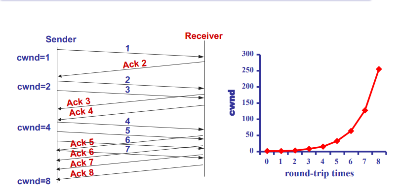
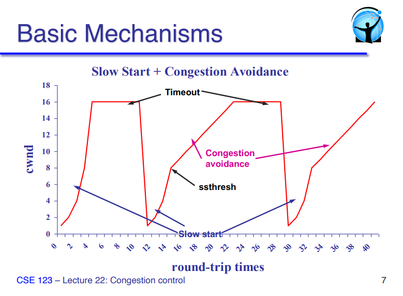
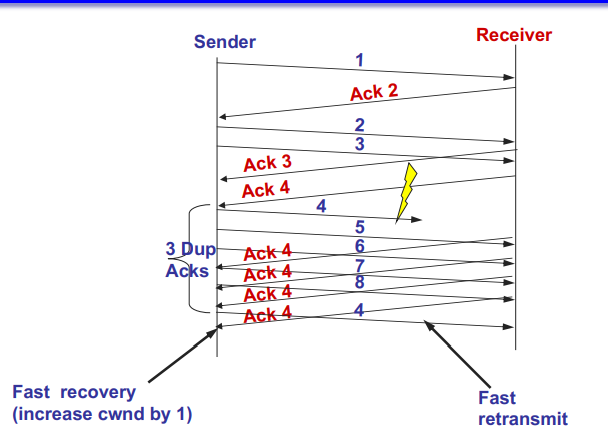
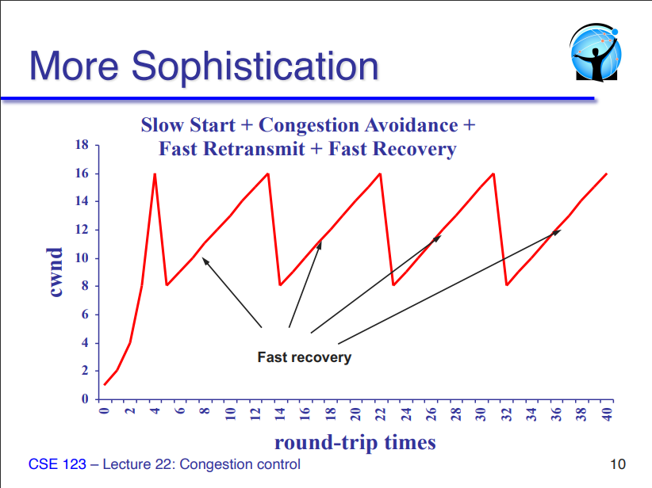
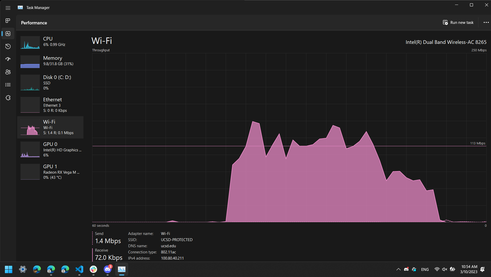
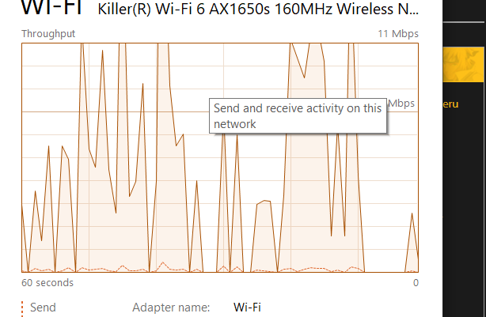
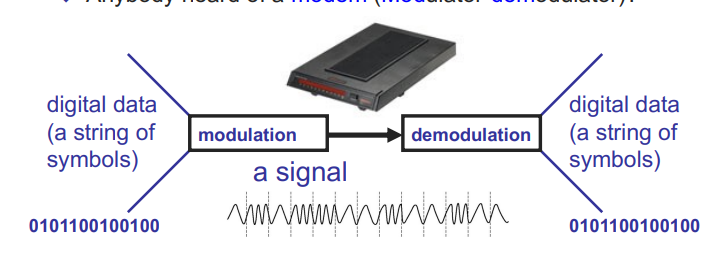
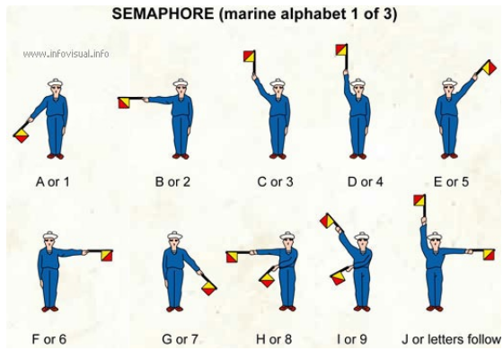
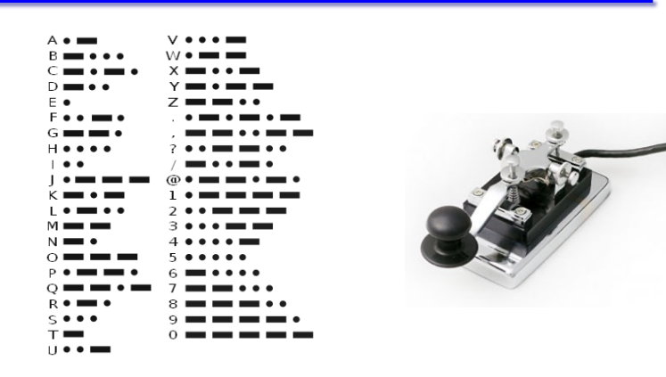

# Congestion Control cont

## Review
- Basic TCP Algorithm: decrease rate when congestion happens
- Congestion Avoidance: detect ahead of time and early decrease rate
  - additive increase
  - multiplicative decrease

## TCP Bandwidth Probing

- TCP uses AIMD to adust congestion window
  - converges to fair share of bottleneck link
  - Increases modestly in good times
  - Cuts drastically in bad times

- But what rate should a TCP flow use initially?
  - Need some initial congestion window
  - We'd like TCP to work on all manner of links
  - Need to span 6+ orders of magnitude (e.g. 10K to 10Gbps)
    - link layer is abstracted (could be any type of link could be under this transport protocol)
  - Starting too fast is catastrophic!

## Slow Start

- Goal: quickly find the equilibrium sending rate

- Quickly increase sending rate until congestion detected
  - Remember last rate that worked and don't overshoot it
  
- TCP Reno Algorithm
  - On new connection / after timeout: set **cwnd** = 1MSS
  - For each segmenet ack, increment **cwnd** by 1MSS
    > DOUBLES! It's exponential
  - If timeout then divide **cwn** by 2, and set **ssthresh=cwnd**
  - If **cwnd** >= **ssthresh** then exit slow start

- Why called slow? It's exponential after all...
  - coz it needs to ramp up

> Nearly every implementation of TCP uses Slow Start

Basically "fuck around and find out" quickly and LEARN

## Fast Retransmit & Recovery

- Fast retransmit
  - Timeouts are slow (default often 200ms or 1s)
  - When packet is lost, receiver still ACKs last in-order packet
  - Use 3 duplicate ACKs to indicate a loss; detect losses quickly
    - Why 3? When wouldn't this work?
  > Only works when ALL HOSTS are edging on going too fast
  > If some really high flow fills up the queue, then everyone's packets get dropped and dup ACKS aren't even received `-->` everyone re

- Fast recovery
  - Goal: avoid stalling after loss
  - If there are still ACKs coming in, then no need for slow start
  - If a packet has made it through `-->` we can send another one
  - Divide **cwnd** by 3 after fast retransmit
  - Increment **cwnd** by 1 MSS for each additional duplicate ACK

> Real world example: downloading a single large file. You can see the download speed slow start, then fast recovery fiddling up and down

> TCP-Reno is decades old btw. It's still cutting speeds by half even on fast recovery. There's been research and progress. 
> They kept naming them (new TCP implementations + algorithms) after cities in Arizona lmao (Reno, Vegas, ...). Prob coz the TCP group met up around there.

## Short Connections

> Web page loadups, instant messaging, etc. Most applications only use network for a short burst.

- Short connection: only contains a few pckts

- How do shrot connections and Slow-Start interact?
  - What happens when a packet is lost during Slow-Start?
  - What happens when the SYN is dropped?

- Bottom line: Which packet gets dropped matters a lot
  - SYN
  - Slow-start
  - congestion avoidance

- Do you think most flows are short or long?

- Do you think most traffic is in short flows or long flows?

## Open Issues

> interesting/fun problems not within the scope of this class.

- TCP is designed around the premise of cooperation
  - What happens to TCP if it competes with a UDP flow?
  - What if we divide **cwnd** by 3 instead of 2 after a loss?

> DDOS. "good" hosts will do congestion control and assume everyone else is too. Maicious actors will take advantage of those "good" hosts giving up bandwidth (timeout/fast recovery cuts) and hogs even more bandwidth. Then those "good" hosts will suffer even more, they'll keep lowering their threshold values as the Malicious consume even more bandwidth.

- Tere are a bunch of magic numbers
  - Decrease by 2x, increase by 1/**cwnd**, 3 duplicate ACKs, initial timeout = 3 secondsjo

- But overall it works really well!
  - Still being constantly tweaked... to ths day!

> Eternal debate. Always tradeoffs. But it's fun

## TCP CC Summary

- TCP Probes the network for bandwidth, assuming that loss

- The congestion window is managed with an additive increase/multiplicative decrease policy
  - It took fast retransmit and fast recovery to get there
  - Fast recovery keeps pipe "full" while recovering from a loss

- Slow start is used to avoid lengthy initial delays
  - Ramp up to near target rate, then switch to AIMD

---

#### Case Study

Task Manager > Performance > Wi-Fi tab

Running speed test (https://fast.com) on campus Wi-Fi: 

You can see the concepts in action!
- slow start
- fast retransmit

Roommmate complained about dropped connections on home Wi-Fi:

Prof mentioned those constant drops down to slow start is not healthy. The network is likely very congested. Guessing someone on the network is using up a lot of bandwidth!

---

## Underneath it all: Sending bits

- A three-step process
  - Take an input stream of bits (digital data)
  - Modulate some physical media to send data (analog)
  - Demodulate the signal to retrieve bits (digital again)
  - Anybody heard of a **modem** (MODulator DEModulator)

> All physical links do the modulation and demodulation

### A Simple Signaling System

- Discrete alphanumeric values translated into hand positions. Light waves --> receiver translates back into descrete alphnumeric values 

- Discrete symbols --> tones (short/long)