# Leture 21: Buffering & Scheduling

## Overview

- Router buffer management
  - FIFO
  - RED

- Router traffic Policing/Scheduling

## RED Algorithm

- Maintain running average of queue lengt in router
- If $avg < min_{thresh}$ do nothing
  - low queueing, send packets through
- If $avg > min_{thresh}$, drop packet
  - Protection from misbehaving sources
- Else drop/mark packet in a manner proportional to queue length
  - Dropping notifies sources of incipient congestion
  - Q: Dropping vs Marking (Expliciti Congestion Notification)
    > Why drop to notify of congestion rather than mark in header?

## RED Operations

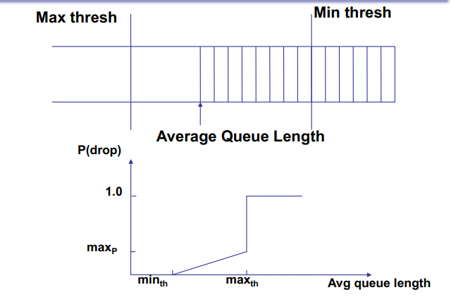

## Scheduling
- So far we've done **traffic policing**
  - Limit the rate of flows regardless of the load in the network

- Routers also need **scheduling**
  - Dynamically allocate resources when multiple flows comete
  - Give each "flow" (or src/dest pair) their OWN queue (theoretically)

- Weighted fair queueing
  - Proportional-share scheduling
  - Schedule round-robins among queues in proportion to some weight parameter

### Example with contending hosts
  - 1 UDP (10 Mbps)
  - 31 TCP sharing 10 Mbps
    > Note: TCP will throttle due to congestion control

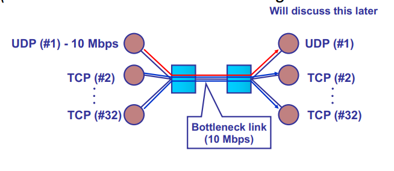

#### UDP vs TCP w/ FIFO
  - TCP is too nice, 
  - UDP hogs all the resources and gets all the bandwidth

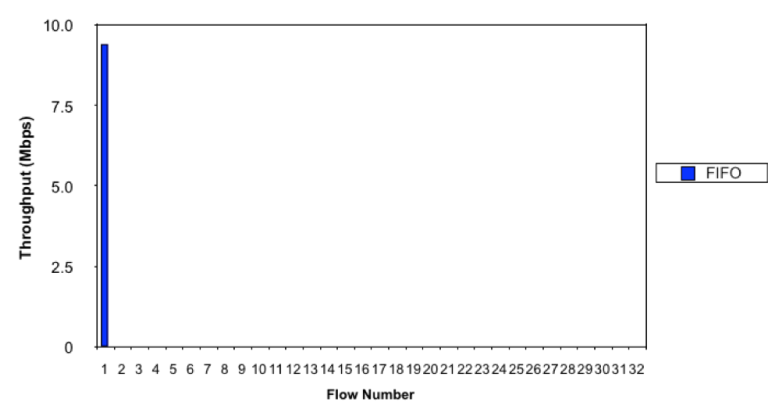

#### UDP vs TCP w/ Fair Queueing
  - Roughtly equally splits up bandwidth across flows

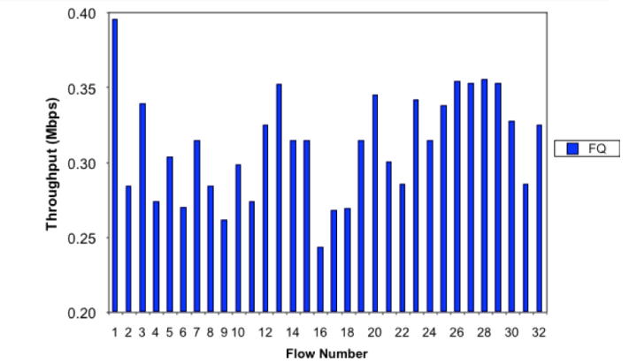

## (Weighted) Fair Queueing

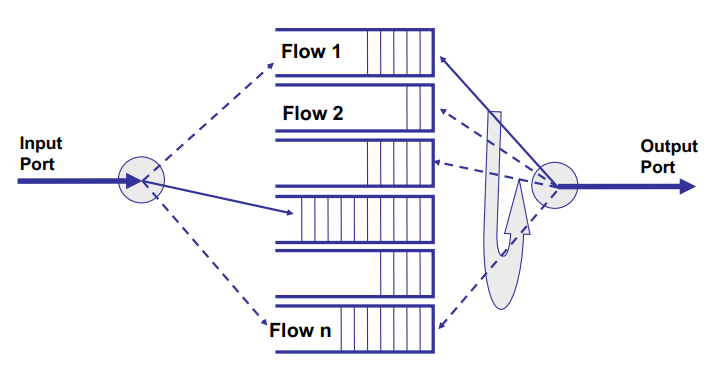
 
- Maintain a queue for each flow
  - What is a flow?
    - We approximate this w/ 5 tuple
     `(IP src, IP dst, port src, port dst, protocol)`

> Devices on LAN have distinct flows 

- Implements **max-min fairness**: each flow receives $min(r_i, f)$, where
  - $r_i$ - flow arrival rate
  - $f$ - link fair rate 
  > will give any flow UP TO $f$ amount. 
  > Note it's not always (bandwidth)/(number of flows) -- see next slide

- **Weighted Fair Queueing** (WFQ) - associate a weight with each flow to divvy bandwidth up non-equally

### Fair Rate Computation

- If link congested, compute $f$ such that

```math
\sum_i \text{min}(r_i, f) = C
```

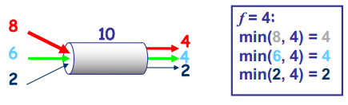

### Weighted Fair Queueing

- Associate a weight $w_i (priority)$ with each flow $I$
- If link congested compute $f$ such that

```math
\sum_i \text{min}(r_i, f\times w_i) = C
```
> I.e. The flow is just the fundamental sharing unit. Weight determines HOW MANY units a flow deserves
> - Use case: Streaming 4K videos require 10Mbps CONSTANTLY. 
> - The amount of bandwidth you use on your network ain't that high, it just needs to be RELIABLE
>   - Don't buy the huge Gbps data plans. They're ridiculous!

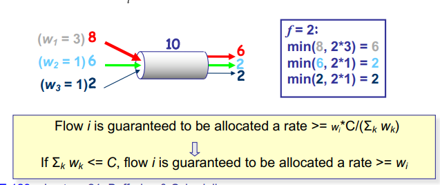

## WFQ Implementation: Fluid FLow

- It's tricky to implement WFQ when there are different packet sizes in different queues
  - Can only serve one packet at a time

- Simplification: Flows can be served one bit at a time

- WFQ can be implemented using bit-by-bit weighted round robin
  - During each round from each flow that has data to send, send a number of bits equal to the flow's weight

> Each flow has to 'fill up' to how much they want to send (in the bit-by-bit weighted round robin) before that packet gets sent.
> - Heavier weight = faster fillup

### Fluid Flow Example

- Red flow has packets backlogged between time 0 and 10
- Other flows have packets continuously backlogged
- All packets have the same size

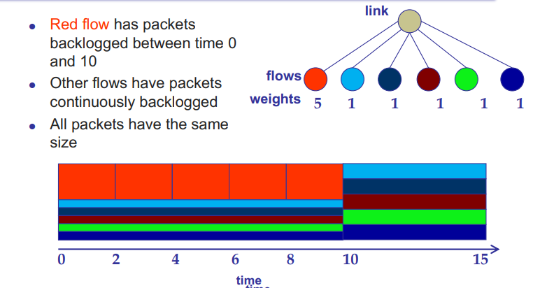

- 5 whole packets for Red gets sent in the same time the others get 1 packet sent. 
- Once Red is done, the fair rate is updated and all the others speed up their "filling up rate"

## Packet-Based Implementation

- Packet (real) system can't do bit-by-bit splitting: packet transmission cannot be preempted. 

- Issue: flows can get more bandwidth by sending bigger pakets

- Solution: serve packets in the order in which they would have finished being transmitted in the fluid flow system

### Packet-Based example

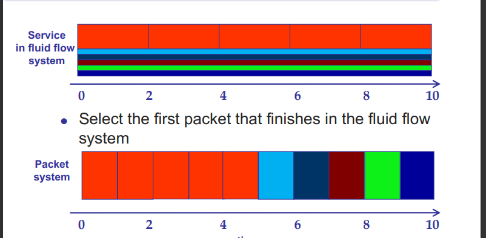

## Token Bucket

> Similar to WFQ, but doesn't allocate spare capacity

- Parameters
  - r - average rate (i.e. rate at which tokens fill the bucket)
  - b - bucket depth (limits size of burst)
  - R - max link capacity or peak rate (optional parameter)

- A bit can be transmitted only when a token is available

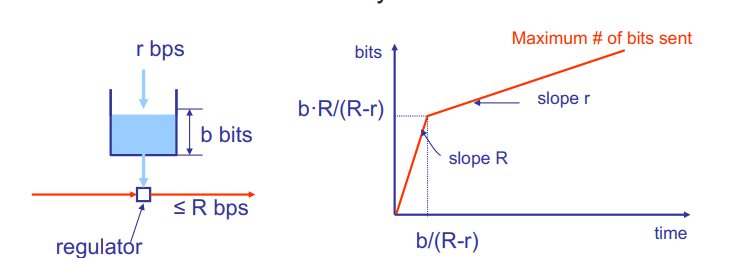

> Incredibly popular scheme for internet providers. User get a REALLY high bandwidth but do nothing afterwards. I.e. only "when it matters". Most of the internet has bursty traffic so this works.

## Traffic Policing

- Drop packets that don't meet **flow policy**
- Output limited to average of $r$ bps and bursts of b

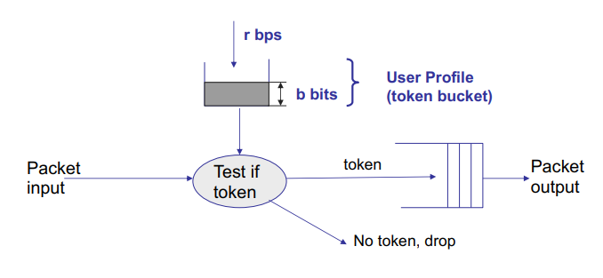

- Very agressive policy: Drops packets if exceeds policy rate
  - User will have to detect loss and resend packets

## Traffic Shaping

- Shape (queue) packets according to flow policy
- Output limited to average of $r$ bps and bursts of $b$

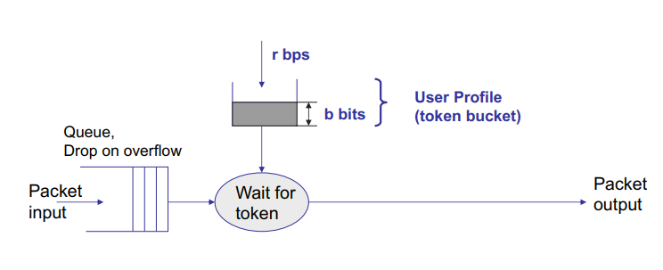

- Less agressive: Tries to help user shape 