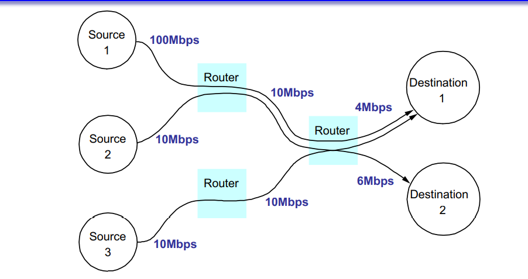
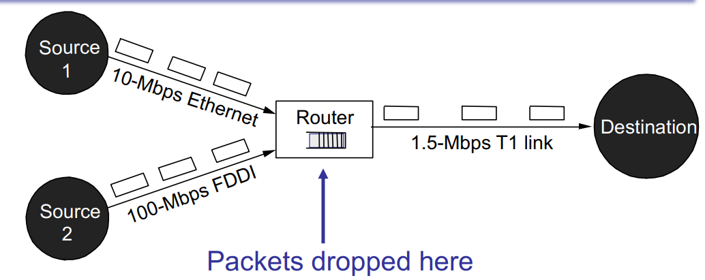
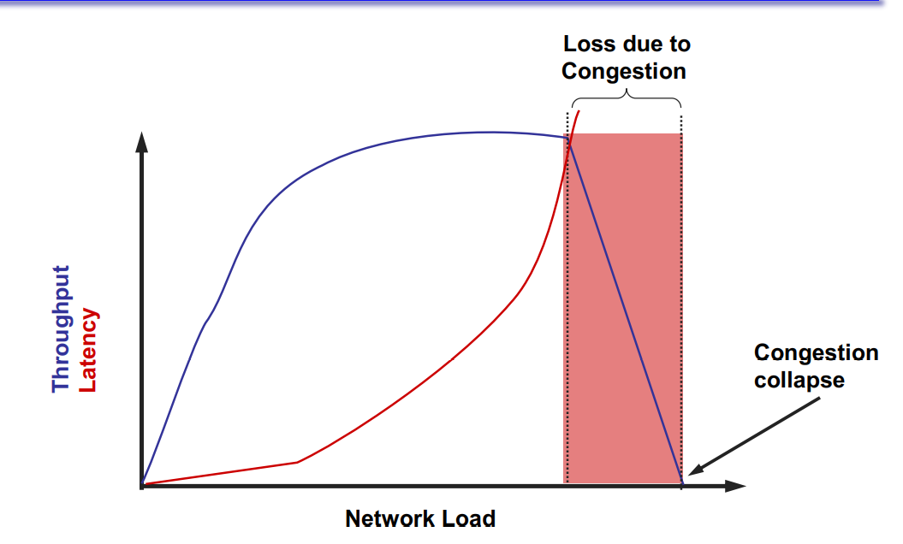
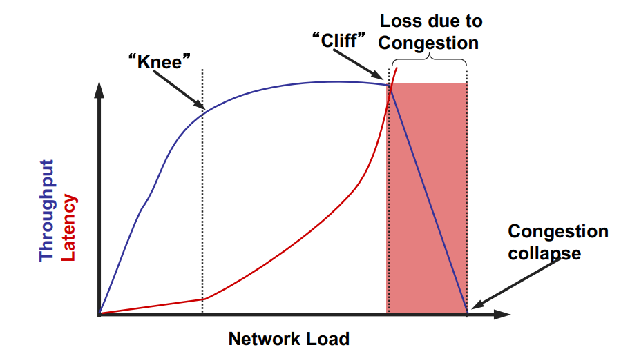
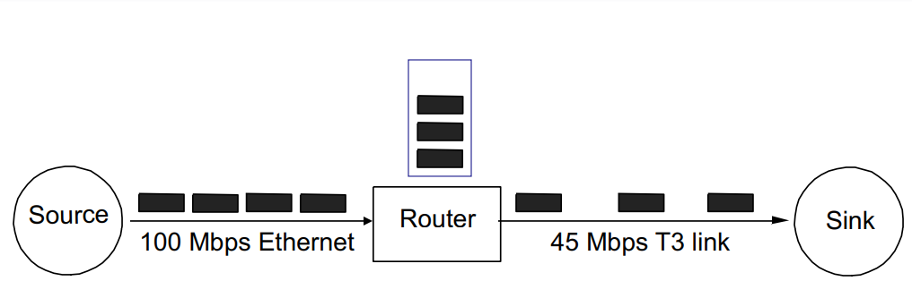

# Congestion Control
This topic is very important and a lot of network applications need to carefully consider their interaction with this

## Overview

- Finish **Router-based** buffering and scheduling
- Introduce **Host-based** congestion control

## Host-based congestion control

- How fast should a sending host transmit data?
  - Goldilocks: not too fast, not too slow, just right...

- Should not be faster than the sender's share of bw
  - Bandwidth allocations dividing up fairly between hosts

- Should not be faster than the network can process
  - Congestion control

- Congestion control & bandwidth allocation are separate ideas, but frequently combined

> Host have very little context regarding their network though. Only ACK or drop...

## Bandwidth allocation

- How much bandwidth should each **flow** from src-->dst receive when they compete for resources?
  - What is a "fair" allocation?

> Note: it's actually not obvious... Also impossible to be perfectly fair since we don't have enough knowledge - We don't know explicitly how much bandwidth the router has, nor do we know the bandwidth needs of the other hosts 

## Congestion occurs at Routers

- Buffer intended to absorb bursts when input rate > output
- But if sending rate is persistently > drain rate, queue builds
- Dropped packets represent wasted work; goodput < throughput

## Drop-Tail Queuing Problem

- Latency increase w/ network load --> router gets overloaded
- drastic increase in latency happens when buffering occurs
  - rate limits in place once buffer fills
  - Throughput levels off once queue gets full and connection is rate limited

- Throughput DROPS if you go past rate limit. You keep sending things even though you're told to slow down because the queue is full
  - Router starts REJECTING and DROPPING packets (**Loss due to Congestion**)
  - Out of network load, actual throughput drops since packets are loss. And you lose more as you increase network load.
  - Network --> inf : Throughput Asymptotally approaches 0 (**Congestion Collapse**)

## Congestion Collapse

- Rought definition: "When an increase in network load produces a decrease in useful work"

- Why does it happen?
  - Sender sends faster than **bottleneck link** speed
  - Packets queue up until they are dropped
  - In response to packets being dropped, sender retransmits (as well as sending additional packets)
  - All hosts repeat in steady state...

> Was an actual issue back in the 90s when the internet got popular. Research into Congestion Control happened as a result of internet going down --> nowadays, hasn't happened in a long time

### Mitigation Options

- Increase Network Resources (throw \$\$ at the problem)
  - More buffers for queueing (this leads to "Bufferbloat")
    - caching/queuing is only useful if it stays small
    - large buffers --> persistently long 
      - Opens up space for a LONG ASS BURST. And you'll be waiting in line for a long time (seconds)
  - Increase link speed
  - Pros/Cons of these approaches?
    - Zealots exist that have very strong "anti-bufferbloat" sentiment

- **Reduce network load**
  - Hosts send data more slowly
  - How much more slowly?
  - When to slow down?

## Designing a Control Scheme

> Will never be solved. There are always TRADEOFFS --> leads you into a non-ideal situation. 
> 
> Decades worth of research and dev for:
> - new schemes, 
> - new algorithms, 
> - new policies, etc. 
> 
> This is the P=NP of networking. Really fun to work on though

**How?**
- Open loop
  - Explicitly reserve bandwidth in the network in advace
  > Terrible. too much trust in others. links can lie about how much bandwidth they're gonna use

- *Closed loop*
  - Respond to feedback and adjust bandwidth allocation

**Where?**
- Network-based
  - Network implements and enforces bandwidth allocation
  > We don't do this

- *Host-based*
  - Hosts are responsible for controlling their sending rate

> Ideally, Simple and End-To-End

## Proactive vs Reactive

- **Congestion avoidance**: try to stay to the left of the "knee" (bandwidth)
  - Avoid causing an issue
- **Congestion control**: try to staay to the left of the "cliff" (latency)
  - On the edge of danger

## Challenges to Address

- How to **detect** congestion?
- How to **limit** sending data rate?
- How **fast** to send? (what initial rate? what limiting rate?)

## Detecting Congestion

- Explicit congestion signalling
  - Source Quench: ICMP message from router to sender
    - IP option (recall that header can be extended)
  - DECBit / Explicit Congestion Notification (ECN)
    - Router *marks* packet based on queue occuppancy (i.e. indication that packet encountered congestion along the way)
    - Receiver tells sender if queues are getting too full
  > Did not fly. Did not scale. Hard to update existing infrastructure that are relied on.

- *Implicit congestion signalling* 
  - Packet loss (remember router drop policy?)
    - Assume congestion is primary source of packet loss
    - Lost packets indicate congestion
  - Packet delay
    - Round-trip time increases as packets queue
    - Packet inter-arrival time is a function of bottleneck link

## Throttling Options

- Sender Window-based (TCP)
  - Constrain number of outstanding packets allowed in network
  - Increases window to send faster; decrease to send slower
  - Pro: Cheap to implement (already have windowing), good failure properties
  - Con: Creates traffic **bursts** (requires bigger buffers)

- Rate-based (many streaming media protocols)
  - Two parameters (period, packets)
  - Allow sending of x packets in period y
  - Pro: smooth traffic
  - Con: fine-grained per-connection timers, what if receiver fails?

## Choosing a Send Rate

- Ideally: Keep equilibrium at "knee" of power curve
  - Find "knee" somehow
  - Keep number of packets "in flight" the same
  - Don't send a new packet into the network until you know one has left (i.e. by receibing an ACK)
  - What if you guess wrong, or if bandwidth availability changes?

- Compromise: adaptive approximation
  - If congestion signaled, reduce sendind rate by x
  - If data delivered successfully, inrease sending rate by y
  - How to relate x and y? Most choices don't converge...

> Adaptive like ML, it's using sent packet history to learn about network limits.
> Using sent packets as a probe. A solid idea for working up to equilibrium. BUT needs to be modded to work more efficiently for slowing DOWN to equilibrium (e.g. new host joins network and actual bandwidth for curr link is lower -- need to figure that out more quickly!)

## TCP's Probing Approach

- Each source indepenedently probes the network to determine how much bandwidth is available
  - Changes over time, since everyone does this

- Assume that packet loss implies congestion
  - Since errors are rare; also, requires no support from routers

## Basic TCP Algorithm

- Window-based congestion control
  - Unified congestion control and flow control mechanism
  - *rwin*: advertised flow control window from receiver
  - *cwnd*: congestion control window
    - Estimate of how much outstanding data [that the] network can deliver in a round-trip time
  - Sender can only send MIN(*rwin, cwnd*) at any time

- Idea: decrease *cwnd* when congestion is encountered; Increase *cwnd* otherwise
  - Question: how much to adjust?

## Congestion Avoidance

- Goal: Adapt to changes in aailable bandwidth

- Additive ncrease, Multiplicative Decrease (AIMD)
  - Increase sendign rate by a constant (e.g. TCP MSS)
  - Decrease sending rate by a linear factor (e.g. divide by 2)

- Rough intuition for why this works
  - Let $L_i$ be queue length at time $i$
  - In steady state: $L_i = N$, where $N$ is a constant
  - During Congestion:
    - $L_i = N + yL_{i-1}$ where $y > 0$
  - Consequence: queue size increases multiplicatively
    - Must reduce sending rate multiplicatively as well